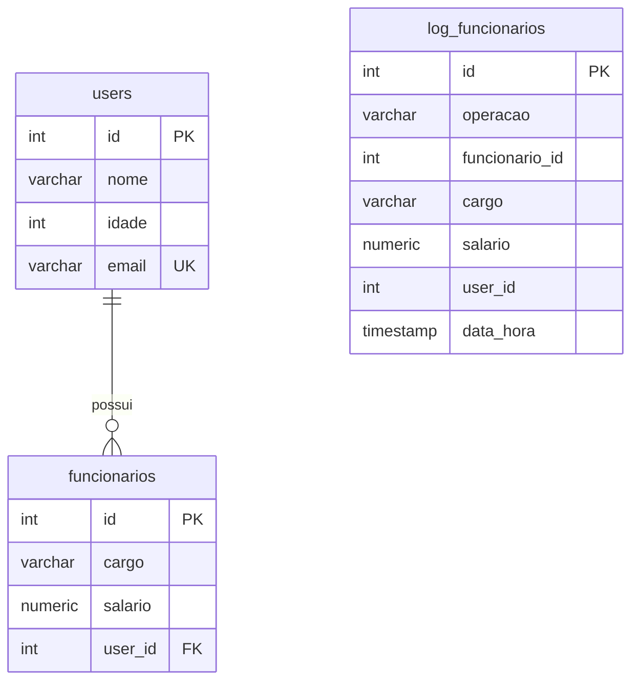
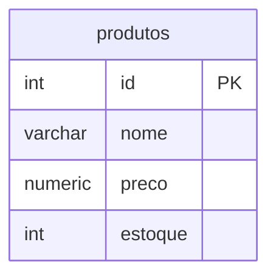

# Diagramas de Relacionamento - Triggers

## Caso 1: Trigger AFTER (arquivo `TRIGGERS.sql`)

Triggers `AFTER INSERT`, `AFTER UPDATE` e `AFTER DELETE` em `funcionarios`, que gravam cada operação em `log_funcionarios`.

| Tabela | Campo | Observação |
|---|---|---|
| users | idade | CHECK idade >= 0 |
| log_funcionarios | operacao | INSERT, UPDATE ou DELETE |
| log_funcionarios | funcionario_id | sem FK, copiado pela trigger |
| log_funcionarios | user_id | sem FK, copiado pela trigger |

Observação: `log_funcionarios` não tem relacionamento declarado. Os campos `funcionario_id` e `user_id` são apenas valores copiados pelas triggers.

---

## Caso 2: Trigger BEFORE (arquivo `TRIGGERS_BEFORE.sql`)

Triggers `BEFORE INSERT` e `BEFORE UPDATE` em `produtos`. Elas validam o preço e podem alterar ou cancelar a operação antes de gravar.

| Tabela | Campo | Observação |
|---|---|---|
| produtos | nome | gravado em maiúsculas pela trigger |
| produtos | preco | deve ser maior que zero |
| produtos | estoque | DEFAULT 0 |

Observação: `produtos` é uma tabela independente, sem relacionamento com as demais.
